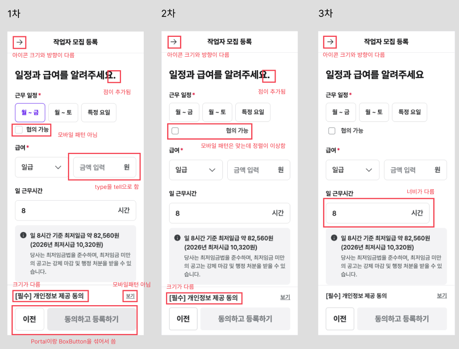

### [Agent Coding] figma-to-code 정합성 확보 > figma-implement.md 작성

> 이전 단계 : [테스트 기획](./260807.md#agent-coding-figma-to-code-구현-품질-개선--테스트-기획) / [테스트 과정](./260811.md#agent-coding-figma-to-code-구현-품질-개선--테스트-과정)

code connect 연결으로도 계속 재현되는 문제점이 바로 하네스 > 에이전트 지침 문서를 보완함으로써 검증할 후보였다.

- 텍스트·레이아웃도 임의 마크업 대신 디자인 시스템 컴포넌트와 타이포 토큰을 써야 한다

- 구현 전 `get_code_connect_map` figma mcp로 매핑을 확인한다 — 2차에서도 호출하지 않았고 get_design_context에 실려 온 정보로 성공한 것

## <br />

> 👇 아래는 figma-implement.md 내용

<br />

# Figma 구현

Figma 디자인을 이 저장소의 코드로 옮길 때 지키는 규칙이다. 
Figma MCP가 제공하는 `figma-design-to-code` 스킬과 별개이며, 이 문서는 **이 저장소의 컴포넌트·토큰·검증 기준**이다.

## 1. 구현 전에 Code Connect 매핑을 확인한다

- Figma URL을 받으면 코드를 쓰기 전에 `get_code_connect_map`으로 해당 프레임의 매핑을 조회한다. `get_design_context` 결과에 매핑 정보가 섞여 오더라도 그것으로 대신하지 않는다. 

- 응답을 JSON 파일로 저장한다. `design-check`를 실행할 때 `--cc` 인자로 넘긴다.

- 매핑이 있는 노드는 그 컴포넌트를 쓴다. 스니펫이 import 경로만 제공하더라도 매핑은 유효하다.

- 매핑이 없는 노드는 새로 만들기 전에 저장소에서 대응 컴포넌트를 찾는다. 찾지 못했으면 직접 구현 여부를 사용자에게 묻는다.

- 구현을 마치면 **조회한 노드 전체를 표로 정리해 보고한다.** 노드 ID, 매핑된 컴포넌트명, 실제 구현에 쓴 것을 적는다.

## 2. 텍스트를 포함한 화면의 모든 요소에 컴포넌트와 스타일 헬퍼를 쓴다

- **이미지·아이콘을 새로 만들지 않는다.** 저장소의 애셋과 아이콘 컴포넌트를 먼저 찾는다. 없으면 직접 만들기 전에 보고한다.

- 직접 만들 때도 스타일은 디자인 시스템 토큰으로 지정한다.

### 주의 — Figma 응답의 CSS 변수는 토큰이 아니다
 
`get_design_context` 응답에는 이런 값이 섞여 온다.

    ```
    var(--bg-bg-neutral-normal, #fff)
    gap-[var(--spacing/12,12px)]
    text-[length:var(--font-size/title/title-sm,20px)]
    rounded-[var(--radius/8,8px)]
    ```

**Figma 쪽 변수명이며 이 저장소에 정의되어 있지 않다.** 그대로 옮기면 정의되지 않은 변수가 되어 폴백 값만 적용된다. 저장소의 디자인 시스템 토큰과 스타일 헬퍼로 치환한다. 사용 가능한 토큰 이름은 디자인 시스템 SCSS와 빌드 결과를 기준으로 확인한다.

| Figma 응답 | 치환 예시 |
|---|---|
| `var(--bg-bg-neutral-normal, #fff)` | `$white` |
| `gap-[var(--spacing/12,12px)]` | `gap: $spacing-12` |
| `text-[length:var(--font-size/title/title-sm,20px)]` | `@include typo(title-sm, ...)` |
| `rounded-[var(--radius/8,8px)]` | `border-radius: $radius-8` |

## 3. 구현 후 Figma 값과 대조한다
- 완료를 선언하기 전에 `get_design_context` 응답에서 **간격·폰트 크기·행간·폰트 색상** 값을 뽑아 구현 결과와 하나씩 대조한다. 응답에는 변수명과 실측값이 함께 들어 있다.

- **너비와 높이도 대조한다.** `get_metadata` 응답의 노드별 `width`·`height`가 기준이다. 컨테이너 폭을 채우는 요소인지, 내용 크기로 줄어드는 요소인지를 구분해서 확인한다.

- 코드 쪽 값은 **빌드 산출 CSS**에서 확인한다. 빌드 산출을 얻지 못했으면 SCSS 원본의 토큰명과 그 정의 값으로 대조하고, 빌드로 확인하지 못했다고 적는다.

- 다른 값이 있으면 고친다. 고치지 않기로 했다면 어느 항목이 얼마나 다른지 보고에 적는다.

## 4. 화면에 보이는 문구는 Figma를 따른다

- 텍스트·라벨·버튼 문구 등 **콘텐츠**는 Figma가 기준이다. 마침표·띄어쓰기·줄바꿈까지 포함한다.

- 컴포넌트가 문구를 덮어쓸 prop을 제공하면 그것을 쓴다.

- 덮어쓸 수단이 없으면 공용 컴포넌트나 공용 상수를 고치지 말고, 어느 문구가 어떻게 다른지 보고한다.

## <br />

### [Agent Coding] figma-to-code 정합성 확보 > A 테스트 결과

위의 figma-implement.md 를 적용하니 아래와 같은 테스트 결과를 도출할 수 있었다.




디자인 불일치 사유
#### [A-1]
- 헤더 arrow 아이콘 : asset과 figma와 네이밍 불일치
- 마침표 : Figma와 기존 코드가 상충될 때 기존 코드 따라감
- 체크박스/보기/CTA : code connect 미매핑
- input type / 크기 다른 text : AI 임의 판단

#### [A-2] Code Connect 보완
- 체크박스 : 모바일 패턴 컴포넌트 자체의 문제 (width: 100%)
- 크기 다른 text : 커스텀 마크업 *Code Connect 정비했음에도 재현됨 - 에이전트 지침으로 제어 필요

#### [A-3] 에이전트 지침 보완
- TextInput 너비 :figma-implement.md의 규칙 4에서 '폭'에 대한 검증이 목록에 없었음

### 진행 과정 비교

| 항목 | A-1 | A-2 | A-3 |
| --- | --- | --- | --- |
| 실작업 | 18.3분 | 14.6분 | 19.2분 |
| ├ 탐색·설계 | 10.9 | 7.9 | 9.8 |
| ├ 코드 작성 | 1.1 | 0.9 | 7.1 (작성하면서 검증) |
| └ 검증·보고 | 6.3 | 5.7 | 2.3 |
| 응답 턴 | 160 | 115 | 149 |
| output 토큰 | 115,281 | 83,463 | 118,436 |
| 도구 호출 | 99 | 70 | 92 |
| 불일치 보고율 | 25% | 100% | 100% |
| 디자인 불일치 건 | 7건 | 4건 | 2건 |