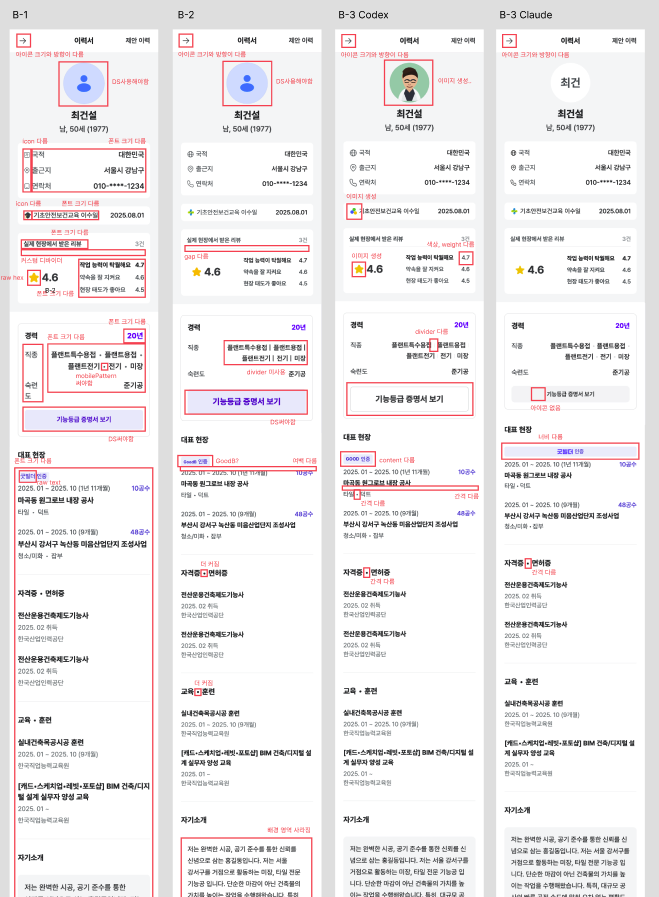

### [Agent Coding] figma-to-code 정합성 확보 > design-check.mjs 보완

> 이전 단계 : [에이전트 지침 보완 : figma-implement.md 작성](./260812.md#agent-coding-figma-to-code-정합성-확보--figma-implementmd-작성) / [A 테스트 결과](./260812#agent-coding-figma-to-code-정합성-확보--a-테스트-결과)

* 빌드 : $spacing-2397 / @include typo({없는토큰값}) ... 을 컴파일 실패로 잡음
* stylelint : 속성 순서 및 형식 등을 잡음

A-3 불일치 원인을 분석하다 보니 빌드와 stylelint로도 놓칠 수 있는 부분을 발견하여 위반 항목과 검토 항목을 검사하는 스크립트를 추가했다.

#### 위반사항 (exit 1)
* 정의되지 않은 CSS 변수 : 코드의 var(--x)를 저장소에 정의된 --x 값들과 대조
* Figma 임의값 유틸리티 흔적 : gap-[var(--...)] 같은 Tailwind 표기가 잔존하는지 검사

#### 사람이 검토 필요 (exit 0)
* 자체 제작 애셋을 사용해도 되는지
* Code Connect 매핑과 다른 구현을 허용해도 되는지 : 매핑의 snippetImports와 실제 import 집합이 다를 경우

 

> figma-implement.md의 검증 섹션에도 추가
- 구현을 마친 뒤 Figma 값 대조 전에 `yarn design-check <구현 디렉터리> --cc <저장한 매핑 JSON>`를 실행하고, 위반사항을 고친다. 검토 항목은 사유를 남긴다.

##  

### [Agent Coding] figma-to-code 정합성 확보 > B 테스트 결과

이어서 다른 화면인 B-1~3을 진행했다. A는 Claude Opus 5, B는 Codex 5.5로 모델도 나눴는데 Claude 쪽이 구현 품질이 나아 보여 Claude Opus 5로 한 번 더 돌리는 Round도 추가했다.

figma-implement.md를 보완하고 design-check.mjs로 검증 단계를 추가하니 아래와 같은 테스트 결과를 도출할 수 있었다.

### 라운드 요약

| 라운드 | 조건 | 구현 소요 | 시각 지적 | 핵심 결과 |
| --- | --- | --- | --- | --- |
| B-1 | CC 정비 전 · 문서 없음 | 11.9분 | 11건 이상 (폰트 크기 거의 다 다름) | 탐색 2.9분으로 짧은 대신 정확도 낮음. 불일치 보고 0건 |
| B-2 | CC 정비 후 · 문서 없음 | 10.0분 | 8건 | 컴포넌트 채택은 개선, 스타일 코드 품질은 악화 |
| B-3 Codex | CC + 에이전트 문서 보완 + design-check | 14.7분 | 10건 | 스타일 위반 0건 |
| B-3 Claude | CC + 에이전트 문서 보완 + design-check | 23.3분 | 4건 | 스타일 위반 0건, 매핑 준수는 Claude가 앞섬 | 

### 진행 과정 비교

| 항목 | B-1 | B-2 | B-3 Codex | B-3 Claude |
| --- | --- | --- | --- | --- |
| 실작업 | 11.9분 | 10.0분 | 14.7분 | 23.3분 |
| ├ 탐색·설계 | 2.9 | 2.6 | 2.0 | 12.7 (절반 이상을 조사에 할애함) |
| ├ 코드 작성 | 7.0 | 6.8 | 11.5 (쓰면서 고침) | 7.6 |
| └ 검증·보고 | 2.0 | 0.7 | 1.2 | 2.7 |
| output 토큰 | 18,604 | 18,297 | 25,611 | 79,546 |
| 도구 호출 | 88 | 88 | 102 | 118 |

### 코드 품질 비교

| 항목 | B-1 | B-2 | B-3 Codex | B-3 Claude |
| --- | --- | --- | --- | --- |
| 코드 파일 / 총 줄 | 6 / 745 | 3 / 771 | 3 / 720 | 15 / 992 |
| px 리터럴 | 53 | 95 | 15 | 8 |
| @include typo | 25회 | 0회 | 준수 | 준수 |
| raw hex | 1 | 30 | 0 | 0 |
| 미정의 CSS 변수 | 0 | 29곳 | 0 | 0 |
| CC 매핑 미채택 | 3종 (미보고) | 3종 | 3 | 1 |
| 빌드 / 검사 | 빌드 통과, 경고 0 | 렌더 확인 불가 — 검사 포기 | 전부 통과 | 전부 통과 |

##  

### [Agent Coding] figma-to-code 정합성 확보 > 인사이트 💡

* 구현시 이미 FE개발 컨벤션과 가드레일, 디자인 시스템 및 스타일 적용 안내에 대한 지침이 하네스로 제공되었음에도 검증 수단의 부재가 품질을 낮추고 있었다. 

* Code Connect는 컴포넌트 채택 경로를 제공하여 탐색 과정의 토큰 감소에 효과가 있으나 스타일 토큰 사용 여부는 보장할 수 없다. 색상·타이포는 CC 관할이 아니며, 저장소 mixin (typo()/color() 등)으로 옮기는 판단은 전적으로 에이전트에게 맡겨져 있기 때문이다.

* 앱에 동명 컴포넌트가 있으면 Code Connect 매핑에서 지시한 경로보다 먼저 발견한 컴포넌트를 쓰는 경향이 크다. 

* 에이전트가 렌더를 볼 수 없으면 Figma가 준 절대값을 그대로 옮기는 것을 안전하다고 판단하여 토큰 치환을 회피하게 된다. design-check로 그 결과를 보완했다. 